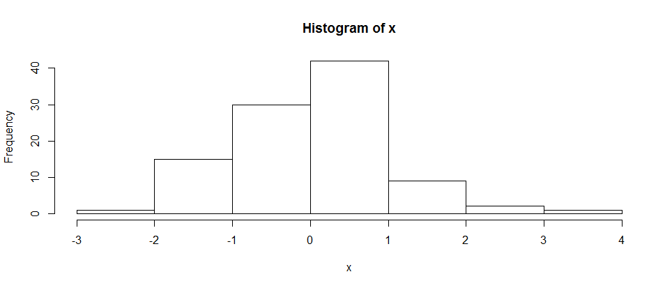

# 學習筆記範例
使用Github紀錄與收集自已的學習收穫    
==================================
[Markdown語法參考資源](http://markdown.tw/)

####好處:  
#####1.再現個人學習過程   
**範例**   
運用R的`rnorm()`建立100個常態分配隨機變數的方法:
```
x <- rnorm(100)
```

繪圖檢查隨機變數是否呈現常態分配   
```
hist(x)
```

   
#####2.養成版本控制習慣   
隨時備份自己的學習成果   
   
指令式使用介面   
[Git Bash](http://git-scm.com/downloads)   
    
圖像化使用介面 *以你用的OS選擇*   
[for Windows](https://windows.github.com/)   
[for Mac](https://mac.github.com/)
